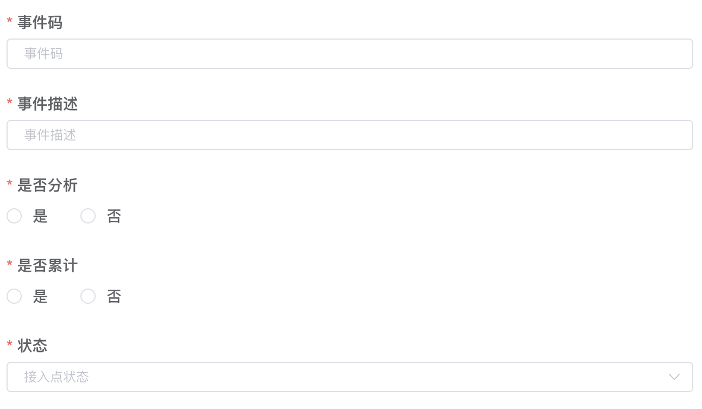

# 规则引擎使用手册

# 事件管理

## 事件字段解释

- 事件码: 业务侧接入风控唯一标识
- 事件描述: 风控运营人员自定义描述
- 是否分析: 分析事件下关联规则
- 是否累计: 分析事件下关联指标
- 状态: 上线/下线

## 关联规则

# 名单管理

## 名单组

<aside>
💡 风控名单没有区分`mobile`,`uid`、黑白名单等类型

</aside>

### 名单组字段解释

- 名单组码: 名单组唯一标识
- 名单组名称: 名单组描述

## 名单

### 名单字段解释

- 名单: 具体名单值,业务侧传给风控的参数均可
- 名单组: 已存在的名单组
- 过期时间: 名单过期时间,最小须大于当前时间30分钟

# 规则管理

## 规则

### 规则字段解释

- 规则码: 规则唯一标识
- 逻辑: 该规则下条件的组合判断逻辑
    - `AND`
        - `true && true` = `true`
        - `false && true` = `false`
    - `OR`
        - `false && false` = `false`
        - `true && false` = `true`
- 优先级: 0-100, 100最高
- 规则结果: 通过/拒绝,即返回给业务侧的最终结果
    - 拒绝: 可选择对应拒绝文案
- 规则状态: 上线/下线

### 条件配置

- 条件描述
- 条件左侧值类型
    - 常量: 用户输入的值
    - 上下文属性: 业务侧入参/预处理的参数
    - 函数: 实时计算函数
    - 指标: 实时累计的指标值
- 条件左侧值
    - 值类型为指标时需填入查询指标的范围
- 条件比较器: > < =
- 条件右侧值类型
- 条件右侧值

### 其余规则配置项

- 关联事件
    
    
    
- 关联惩罚策略
    
    <aside>
    💡 最终命中的规则才会执行,时间规范:数字开头,且Y(年)W(周)M(月)D(日)h(小时)m(分钟)结尾
    
    </aside>
    
    
    

### 规则测试

<aside>
💡 经过测试且测试成功的才可上线

</aside>

## 规则组

<aside>
💡 规则分类展示作用

</aside>

# 拒绝文案

## 文案字段解释

- 返回码: 与业务侧预先定义,以`1001`开头

# 函数管理

## 函数字段解释

- 函数: 函数唯一值,用于规则条件中
- 内置函数: 开发人员预开发的逻辑
- 函数入参: 使用前与开发确认
- 条件逻辑: 与规则下逻辑一致

# 指标管理

## 指标字段解释

- 指标码: 唯一标识
- 累计范围: 即累计时间,`1D`、`1h`
- 累计维度: 选填`userId`,`mobile`
- 累计因子
- 指标类型
    - 单值累计
        
        
        
    - 因子次数累计
        
        
        
        